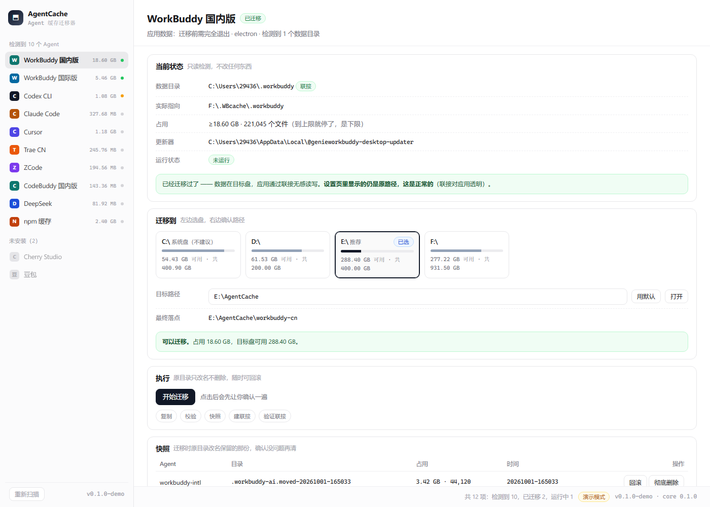
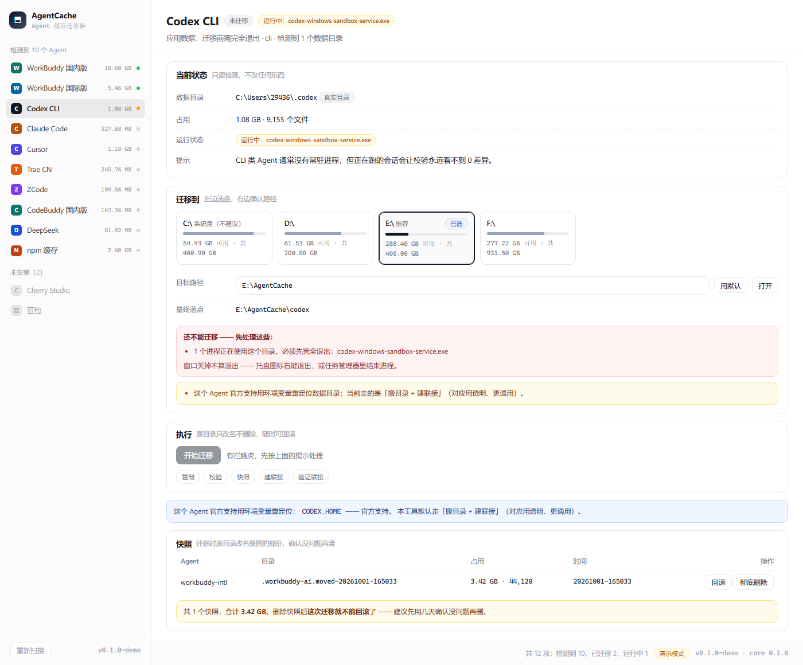

# AgentCache —— 通用 AI Agent 缓存迁移器

[](https://github.com/cv-superding/agent-cache-migrator/actions/workflows/ci.yml)
[](https://github.com/cv-superding/agent-cache-migrator/releases)
[](LICENSE)


把各种 AI Agent（WorkBuddy / Codex / Claude Code / Cursor / CodeBuddy / ZCode / DeepSeek / Trae …）
的数据目录**迁到别的盘**，腾出系统盘空间。

做法是在原路径留一个**重定向点**：原路径原地不动、对应用完全透明，实际文件落到目标盘。
迁移前完整校验、原目录只改名不删除（可回滚），随时能退回去。

> **Windows / macOS / Linux 都支持**，同一套内核，各平台用各自的机制（见 [各平台用的机制](#各平台用的机制)）。

---

## 下载

到 [**Releases**](https://github.com/cv-superding/agent-cache-migrator/releases) 取对应平台的包：

| 平台 | 产物 |
|---|---|
| Windows 10 / 11 | NSIS 安装包（`.exe`）· MSI（`.msi`） |
| macOS | `.dmg` —— **通用包**，一个文件同时支持 Apple Silicon 与 Intel |
| Linux | `.AppImage` · `.deb` · `.rpm` |

> 打 tag（`v*`）会自动触发三平台构建并发布。构建前先跑一遍完整检查 ——
> 其中包含 **unix 迁移的端到端测试**（复制 → 校验 → 建符号链接 → 回滚），
> 所以 mac/linux 这条路是**被真实跑过**的，不是纸面实现。

---

## 界面



左栏自动列出**检测到的 Agent**（图标 / 名称 / 体积 / 状态点：绿=已迁移、橙=运行中、空=未安装），
右栏四块卡片：**当前状态 → 迁移到（盘符卡片带容量条）→ 执行（进度+步骤+日志）→ 快照清理**。

遇到拦路虎会直接说清楚要怎么处理，而不是让你猜为什么点不动：



> 上面两张图来自 `VITE_DEMO_MODE=1` 的演示模式（右下角有角标）——
> 这样界面能脱离 Rust 壳在浏览器里渲染，改样式不用每次等 `cargo` 编译。

布局稿见 [`mockup.html`](mockup.html)（可直接双击打开）。

---

## 为什么不是「写个脚本搬一下」

搬目录本身不难，难的是**搬完不出事**。这个工具专门解决下面这些坑 ——
它们都是实际踩出来、并已固化成回归测试的：

| 坑 | 现象 | 处理 |
|---|---|---|
| **robocopy 预演混入目标侧路径** | `/L` 清单里会打印**目标盘多出来的文件**（应用轮转掉的旧缓存）。按行数当计数，判定永远不收敛 → 每次都报「还有 N 个没搬过去」 | 只统计**源树里**的路径（剥 `\\?\`、盘符大小写不敏感、要求跟分隔符） |
| **应用在跑，目录一直在变** | 只比「文件数 + 字节」看不出变化（同尺寸文件被改写），会被误判成「源目录没动过」 | 额外采集**最新改动时间**，三元组比较 |
| **断链联接挡住运行时解压** | Electron 应用常把运行时做成联接指向安装目录；重装后目标消失 → 应用「解压到临时名再改名落地」永久 `EPERM`，每次启动重做 | 检测断链联接并提示摘除 |
| **ACL 权限位设过头** | 冻结更新缓存时若把「删除」也设成继承，连自己的改名都做不了 | `DE` 只加在目录本身、不继承；隔离时临时解冻再冻回去 |
| **迁移到一半被应用更新重启** | 更新程序把应用拉起来 → 源目录持续改写 → 永远不收敛 | 迁移前检测更新相关计划任务/服务与进程 |

---

## 可扩展性

**加一个 Agent 只改配置，不改代码。** 核心只认「一个或多个数据目录 + 一条进程规则」：

```toml
[[agent]]
id        = "codex"
name      = "Codex CLI"
kind      = "cli"                     # cli | electron | generic
paths     = ["~/.codex"]              # 支持 ~ / %APPDATA% / %LOCALAPPDATA%
processes = ["codex*"]                # 迁移前要退出的进程，可留空
skip      = ["**/node_modules"]       # 可选：这些不进校验
```

内置一份 [`agents.toml`](agents.toml)，用户目录下的同名文件可以**覆盖或追加**。

### 两种迁移策略

| 策略 | 适用 | 说明 |
|---|---|---|
| **搬目录 + 建重定向点**（默认） | 所有应用 | 原路径留一个重定向点，对应用透明，**不需要管理员权限** |
| **改环境变量**（可选） | 应用**官方支持**时 | 更干净、不留重定向点；前提是该应用自己认这个变量 |

### 各平台用的机制

| 平台 | 重定向方式 | 复制方式 |
|---|---|---|
| **Windows** | **NTFS 目录联接**（`mklink /J`） | `robocopy /E /COPY:DAT /DCOPY:DAT /R:0 /W:0 /XJ` |
| **macOS / Linux** | **符号链接** | 内置递归复制（**不用 rsync** —— 各平台参数/是否预装都不一致） |

两平台上**语义完全对齐**的两点（改动时别破坏）：

- 🔴 **都不跟随**源目录里已有的符号链接/重解析点（对应 Windows 的 `/XJ`）——
  否则会把链接指向的整棵树也复制一遍，可能是几十 GB 且在另一块盘上。
- 🔴 **摘除时都只摘链接本身**，绝不递归进目标删真实数据。

> ⚠️ 一个**必须说清的差别**：Windows 的目录联接是文件系统层的「目录别名」，对应用
> **完全透明**；而 unix 的符号链接是一个真实存在的链接文件，绝大多数程序会正常跟随，
> 但少数会 `O_NOFOLLOW` 或 `lstat` 检测到它。这是 unix 上的通行做法，
> 但比 Windows 那份多一个前提条件。

`env_relocate` 用来标记后者。已在**应用自己的文件里**核实过的：

- `CLAUDE_CONFIG_DIR` —— Claude Code 的 changelog 明确提到（另支持 `XDG_CONFIG_HOME`）
- `CODEX_HOME` —— Codex 自带插件配置里以 `env_vars` 声明

> ⚠️ **不能滥用环境变量**：它是**用户级**的。同一程序若有多个版本（例如 WorkBuddy 国内版/国际版），
> 一个变量会把两份数据指到同一个目录、**互相踩数据**。这种情况只能用联接 ——
> 所以 `workbuddy-*` 故意不提供 `env_relocate`。

### 检测是怎么做的

两条线索并用：

1. **路径存在性** —— `~/.codex`、`%APPDATA%\Cursor` 这类约定目录
2. **Electron 更新器指纹** —— `%LOCALAPPDATA%\<appId>-updater`（或 `@<appId>-updater`）。
   应用可能从没启动过、数据目录还没生成，但**只要装过就有这个更新器目录**，所以它更可靠。

> ⚠️ **appId ≠ 数据目录名**，实测踩过：`@zcodedesktop-updater` 对应的数据目录是
> `%APPDATA%\ZCode`，`@deepseek-aidsh-desktop-updater` 对应 `%APPDATA%\@deepseek-ai`。
> 所以**不能靠 appId 猜路径**，必须显式映射。

---

## 调研：同类项目与已知做法

动手前把同类开源项目翻了一遍（这个领域并不拥挤，★0~4 为主，没有统治级项目）。
已经吸收进设计的：

| 项目 | 借鉴点 |
|---|---|
| [`zennos0609-dotcom/AppDataMover`](https://github.com/zennos0609-dotcom/AppDataMover)（C#, MIT） | **占用检测用 Windows Restart Manager API**（精确到「谁锁着这个文件夹」，比按进程名匹配可靠）；**迁移建议分级** safe/normal/special/system；软件归因（读卸载注册表）；中英双语并跟随系统语言 |
| [`pratham15541/windows-appdata-migrator`](https://github.com/pratham15541/windows-appdata-migrator)（PowerShell） | 「先校验、再切换」的两段式流程 |
| [`snomiao/junction-move`](https://github.com/snomiao/junction-move)（JS） | 「搬走 + 建联接回来」的最小实现，可作对照 |
| [`hwl513782273/WorkBuddyUpdateBlocker`](https://github.com/hwl513782273/WorkBuddyUpdateBlocker)（Swift, macOS） | 同类项目的**免责与边界写法**：写清「依赖内部机制，厂商改版就可能失效」，并在应用升级后提示重新检查 |

**默认目标目录**（三选一，界面上可改）：

1. 该应用主程序不在系统盘 → 搬到 `<主程序目录>\AgentCache\`
2. 否则 → 剩余空间最大的非系统盘 `X:\AgentCache\`
3. 手动指定任意目录

---

## 已内置（实测于 Windows 11）

| Agent | 数据目录 |
|---|---|
| WorkBuddy 国内版 | `~/.workbuddy` |
| WorkBuddy 国际版 | `~/.workbuddy-ai` |
| Codex CLI | `~/.codex` |
| Claude Code | `~/.claude` |
| Cursor | `%APPDATA%\Cursor` |
| CodeBuddy 国内版 | `%APPDATA%\CodeBuddy CN` |
| Trae CN | `%APPDATA%\Trae CN` |
| ZCode | `%APPDATA%\ZCode` |
| DeepSeek | `%APPDATA%\@deepseek-ai` |
| Cherry Studio | `%APPDATA%\CherryStudio` |
| 豆包 | `%APPDATA%\Doubao` |
| uTools | `%APPDATA%\uTools` |
| npm 缓存（`class=safe`） | `%LOCALAPPDATA%\npm-cache` · `~/.npm/_cacache` |

---

## 迁移流程

```
① 扫描    列目录、算体积/文件数、列出联接、检测进程与断链
② 复制    robocopy /E /COPY:DAT /DCOPY:DAT /R:0 /W:0 /XJ
③ 校验    预演一遍，确认「源树里还有 0 个文件没搬过去」；不通过原样退出
④ 联接    原目录改名 <名称>.moved-<时间>，原地建 NTFS 目录联接指向目标
⑤ 完成    重启应用生效
```

**任意一步失败都不动原目录。** 回滚 = 删联接 + 把 `.moved-*` 改回原名。

---

## 项目结构

```
agent-cache-migrator/
├─ agents.toml                内置注册表（加 Agent 只改这里）
├─ crates/
│  ├─ acm-core/               内核：零 GUI、纯逻辑、可单测
│  │  ├─ paths.rs             路径模板展开（~ / %APPDATA% / %LOCALAPPDATA%）
│  │  ├─ fsutil.rs            重解析点判定、联接目标、体积统计
│  │  ├─ locks.rs             Windows Restart Manager —— 精确占用检测
│  │  ├─ procs.rs             进程名匹配（兜底手段）
│  │  ├─ agents.rs            注册表加载/合并/检测/断链检查
│  │  ├─ model.rs             输入输出模型
│  │  └─ migrate.rs           迁移：复制 → 校验 → 快照 → 联接 → 验证（含回滚）
│  └─ acm-cli/                `acm` 命令行 —— **内核可脱离 GUI 验证**
├─ src/                       前端（React + Vite，无 UI 框架，纯 CSS）
└─ src-tauri/                 Tauri 壳：命令层 + 进度事件
```

**为什么先做 CLI**：界面上看到的数据，命令行能原样打出来。出问题时不用猜是内核错了还是界面错了。

```bash
acm detect                 # 检测本机 Agent（--json 给脚本用）
acm plan codex             # 生成迁移计划 —— **不动任何文件**
acm drives                 # 盘符 + 剩余空间 + 自动挑的目标根
acm snapshots              # 列出迁移快照（可回滚的那份）
```

---

## 构建

```bash
# 依赖（React 19 / Vite 7 / Tauri 2）
npm install

# 只跑内核的测试
cargo test --workspace

# 命令行
cargo build -p acm-cli && ./target/debug/acm detect

# 桌面端（开发）
npm run tauri:dev

# 桌面端（打包）
npm run tauri:build
```

## 许可

[MIT](LICENSE) —— 可自由使用、修改、再分发，保留版权与许可声明即可。
